# TERVYX Protocol v1.0

**Trust OS for AI-Generated Knowledge: Eliminating Bias Through Reproducible Governance**


[](https://doi.org/10.5281/zenodo.17364486)
[](https://doi.org/10.5281/zenodo.17364486)
[](https://opensource.org/licenses/MIT)
[](https://creativecommons.org/licenses/by/4.0/)
[](./AI-INTEGRATION-GUIDE.md)
[](./schema.org.jsonld)
[](./api-schema.json)

---

## What is TERVYX?

**TERVYX (Tiered Evidence & Risk Verification sYstem)** is a **trust infrastructure for the AI era**—not just a health fact-checker.

### The Problem
AI systems generate claims without accountability. How do we trust AI-generated information about health products, financial instruments, climate policies, or legal interpretations?

### The Solution: Policy-as-Code Governance
**TERVYX enforces deterministic labeling through policy-as-code governance**, ensuring reproducible, auditable, and bias-free knowledge generation:

- **AI is confined to matching only**: Used exclusively for claim-evidence semantic routing; **LLMs never decide final labels**
- **Policies decide labels**: Final judgments come from **deterministic rules only** (Φ/R/J/K/L gates + TEL-5 thresholds)
- **Everything is traceable**: JSON-LD + DOIs + policy fingerprints + audit hashes enable full provenance
- **Open governance**: Policy changes are versioned (RFC-style) with partial re-evaluation (DAG-based rebuild)

**Key architectural principle**: Policy files (`policy.yaml`, gate rules, journal snapshots) are the **single source of truth** for all labels. The build pipeline is **100% deterministic**—same evidence + same policy = identical artifacts every time.

### Health Products: The First Use Case
We demonstrate TERVYX with **1,000+ entries validating commercial health product claims** (supplements, devices, foods, behavioral interventions). But the protocol is **domain-agnostic** and extensible to:
- **Finance**: Investment performance, risk disclosures, regulatory compliance
- **Climate**: Emission reduction claims, policy impact assessments, ESG metrics
- **Legal**: Statutory interpretations, precedential strength, regulatory analysis

**Core message**: TERVYX is **Trust OS for AI-generated knowledge**, not health-specific software.

## 🎯 Core Features

### 📊 Evidence State Vector (ESV)
Normalized atomic evidence units with standardized schema:
```json
{
  "study_id": "string",
  "year": 2020,
  "design": "RCT|cohort|case-control",
  "effect_type": "SMD|MD|OR|RR",
  "effect_point": 0.18,
  "ci_low": 0.02,
  "ci_high": 0.34,
  "n_treat": 60,
  "n_ctrl": 58,
  "risk_of_bias": "low|some|high",
  "doi": "10.xxxx/abc",
  "journal_id": "sleep_med"
}
```

### 🚪 Gate Governance Protocol (GGP)
Five sequential gates ensuring **safety-first monotonicity**:

| Gate | Name | Type | Safety-Critical | Description |
|------|------|------|----------------|-------------|
| **Φ** | Natural/Category | Deterministic | ✅ Hard Cap | Physiological impossibility / category misrouting → `FAIL` |
| **R** | Relevance | Probabilistic | ❌ | Routing fit between claim and category (threshold: 0.7) |
| **J** | Journal Trust Oracle | Probabilistic | ⚠️ Blacklist | J-Oracle score; predatory/hijacked/retracted → `J-BLACK = 0` |
| **K** | Safety Assessment | Deterministic | ✅ Hard Cap | Absolute caps for contraindications and serious adverse events |
| **L** | Exaggeration Language | Rule-based | ❌ | "cure/permanent/instant/miracle" triggers corrective down-shifts |

**Monotone Invariant (Safety-First)**:
Φ or K violations **cannot be offset by high J scores**. If Φ=FAIL or K=FAIL, final label is **Black/FAIL** regardless of evidence strength. This is a **hard constraint** enforced at build time.

**Implementation References**:
- Gate logic: `engine/gates.py`
- Φ rules: `protocol/phi_rules.yaml`
- L rules: `protocol/L_rules.yaml`
- J* snapshot: `protocol/journal_trust/snapshot-2025-10-30.json`

### 🏆 TEL-5 (TERVYX Evidence Levels)
5-tier classification based on `P(effect > δ)` from Monte Carlo simulation:

| P(effect > δ) | TEL-5 Tier | Final Label | Interpretation |
|---------------|------------|-------------|----------------|
| ≥ 0.90 | 🥇 **Gold** | **PASS** | High confidence |
| 0.75–0.90 | 🥈 **Silver** | **PASS** | Moderate confidence |
| 0.60–0.75 | 🥉 **Bronze** | **AMBER** | Low confidence |
| 0.20–0.60 | 🔴 **Red** | **AMBER** | Very low confidence |
| < 0.20 or Φ/K | ⚫ **Black** | **FAIL** | Inappropriate/Risky |

**Special Rule**: If Φ=FAIL or K=FAIL, tier is forced to **Black** and label to **FAIL** regardless of `P(effect > δ)`. This enforces the monotone invariant.

### 🔬 REML + Monte Carlo Meta-Analysis
- **Estimation**: Random-effects meta-analysis using REML for τ² estimation
- **Simulation**: Monte Carlo sampling (N=10,000) for uncertainty quantification
- **Unified direction**: All effects transformed so benefit is positive
- **Reproducible**: Fixed seeds and deterministic builds

### 🏛️ Journal-Trust Oracle (J*)
Fuses multiple signals with safety-first masking:
- **Quantitative**: JCR/SJR percentiles (normalized to [0,1])
- **Qualitative**: DOAJ/COPE membership
- **Safety**: Retraction/Predatory/Hijacking blacklists → hard J-BLACK

### 📈 Partial Re-evaluation DAG
Efficient updates via dependency tracking:
- Only affected subgraphs recomputed on policy/data changes
- Versioned snapshots for full reproducibility
- Minimal rebuild latency with maximum audit transparency

## 🚀 Quick Start

```bash
# Clone and setup
git clone https://github.com/your-org/tervyx-protocol.git
cd tervyx-protocol
python3 -m venv .venv
source .venv/bin/activate
pip install -r requirements.txt

# Scaffold a new entry (creates a directory with a placeholder evidence.csv)
# Format: {intervention_type} {subcategory} {product} {outcome}
python scripts/tervyx.py new supplements minerals magnesium-glycinate sleep

# Populate the evidence.csv with real study data
$EDITOR entries/supplements/minerals/magnesium-glycinate/sleep/v1/evidence.csv

# Build the official artifact bundle (simulation.json, entry.jsonld, citations.json)
# This is the only supported method for generating compliant entries.
python tools/build_protocol_entry.py entries/supplements/minerals/magnesium-glycinate/sleep/v1

# Inspect structured outputs
cat entries/supplements/minerals/magnesium-glycinate/sleep/v1/entry.jsonld
cat entries/supplements/minerals/magnesium-glycinate/sleep/v1/citations.json

# Fingerprint current policy configuration (captures gate rules + journal snapshot)
python scripts/tervyx.py fingerprint
```

## 🧮 Batch Entry Targeting Helper

The `select_catalog_entries.py` script helps filter the main catalog for batch processing. For example, to select 200 high-priority entries for a rebuild queue:

```bash
python tools/select_catalog_entries.py \
  --priorities high \
  --count 200 \
  --output reports/rebuild_targets.csv
```

## 📁 Repository Structure

```
tervyx-protocol/
├── protocol/
│   ├── schemas/                      # JSON-Schema definitions
│   │   ├── esv.schema.json          # Evidence State Vector (input)
│   │   ├── simulation.schema.json   # Monte Carlo outputs (intermediate)
│   │   ├── entry.schema.json        # Final TEL-5 entry format (output)
│   │   └── citations.schema.json    # Citations manifest (output)
│   ├── journal_trust/
│   │   └── snapshot-2025-10-30.json # J* Oracle snapshot (versioned)
│   ├── taxonomy/
│   │   └── intervention_based_v2.yaml  # v2.0 intervention taxonomy
│   ├── phi_rules.yaml               # Φ gate rules (global forbidden patterns)
│   └── L_rules.yaml                 # L gate rules (exaggeration triggers)
│
├── entries/                          # 1,000+ validated entries (v2 taxonomy)
│   ├── supplements/                 # Dietary supplements
│   │   ├── vitamins/                # vitamin-d, b12, k2, etc.
│   │   ├── minerals/                # magnesium, zinc, iron, etc.
│   │   ├── herbs_botanicals/        # ashwagandha, curcumin, etc.
│   │   ├── amino_acids/             # l-theanine, glycine, 5-htp, etc.
│   │   ├── fatty_acids/             # omega-3, fish-oil, etc.
│   │   ├── probiotics/              # lactobacillus, multi-strain, etc.
│   │   └── antioxidants/            # resveratrol, quercetin, coq10, etc.
│   ├── devices/                     # Physical devices & therapies
│   │   ├── electrical_stimulation/  # EMS, TENS, tDCS (validated energy coupling)
│   │   ├── light_therapy/           # red light, blue light, SAD lamps
│   │   └── thermal_therapy/         # sauna, cryotherapy
│   ├── behavioral/                  # Behavioral interventions
│   │   ├── exercise/                # aerobic, resistance, yoga
│   │   ├── meditation/              # mindfulness, transcendental
│   │   └── sleep_hygiene/           # sleep restriction, stimulus control
│   ├── foods/                       # Whole foods & dietary patterns
│   │   ├── whole_foods/             # beetroot, garlic, ginger
│   │   ├── fermented_foods/         # kimchi, kefir, kombucha
│   │   └── beverages/               # green tea, coffee
│   └── safety/                      # Contraindications & adverse events
│       ├── drug_interactions/       # supplement-drug interactions
│       ├── contraindications/       # pregnancy, disease-specific
│       └── adverse_events/          # hepatotoxicity, nephrotoxicity
│
├── engine/                          # Core processing engine
│   ├── mc_meta.py                   # REML + Monte Carlo meta-analysis
│   ├── gates.py                     # Φ/R/J/K/L gate logic + monotone invariant
│   ├── tel5_rules.py                # P(effect>δ) → TEL-5 tier mapping
│   ├── policy_fingerprint.py        # Policy digest construction
│   ├── schema_validate.py           # Schema validation helpers
│   ├── citations.py                 # Citations exporter
│   └── journal_trust.py             # J* Oracle computation
│
├── tools/                           # Build and validation utilities
│   ├── build_protocol_entry.py      # Official entry builder (3 artifacts)
│   ├── select_catalog_entries.py    # Batch entry targeting helper
│   └── migrate_to_intervention_v2.py # v2 taxonomy migration script
│
├── scripts/                         # CLI and utilities
│   ├── tervyx.py                    # Main CLI (new, fingerprint, status)
│   └── validate_entry_artifacts.py  # Shard-based validation
│
├── policy.yaml                      # Policy configuration (TEL-5, MC, gates, J*)
└── .github/workflows/
    └── ci.yml                       # CI/CD pipeline (sharding, validation)
```

**Current scope**: The repository contains **1,000+ validated entries** organized by **intervention type** (supplements, devices, behavioral, foods, safety). Each entry represents a **commercial product claim** (e.g., "Magnesium glycinate improves sleep quality") with complete artifact bundles:
- `evidence.csv` - Study-level data (RCTs, cohorts)
- `simulation.json` - REML + Monte Carlo results
- `entry.jsonld` - Final TEL-5 label (Schema.org compliant)
- `citations.json` - Structured bibliography with DOIs

**Policy version**: v1.3.0 | **TEL-5 version**: v1.2.0 | **Journal Trust snapshot**: 2025-10-30 | **Taxonomy**: intervention_based_v2.0

## 🔧 Core Engine Implementation

### REML Meta-Analysis
```python
def reml_tau2(y: np.ndarray, v: np.ndarray) -> float:
    """REML estimation of between-study variance τ²"""
    # Grid search + local refinement for optimal τ²
    # Returns τ² that minimizes restricted negative log-likelihood
```

### Monte Carlo Simulation  
```python
def monte_carlo_analysis(mu_hat: float, var_mu: float, delta: float, n_draws: int = 10000):
    """Generate MC samples and compute P(effect > δ)"""
    draws = np.random.normal(mu_hat, np.sqrt(var_mu), n_draws)
    return np.mean(draws > delta)
```

### TEL-5 Classification
```python
def classify_tel5(P: float, phi_violation: bool, k_violation: bool) -> tuple:
    """Map P(effect > δ) to TEL-5 tier and final label"""
    if phi_violation or k_violation:
        return "Black", "FAIL"
    elif P >= 0.80:
        return "Gold", "PASS"
    # ... additional tiers
```

## 📊 Example Artifacts

All entries produce **3 standard artifacts** with required policy anchors and audit fields.

### simulation.json (REML + Monte Carlo Results)
```json
{
  "seed": 20251005,
  "n_draws": 10000,
  "tau2_method": "REML",
  "delta": 0.20,
  "benefit_direction": -1,
  "P_effect_gt_delta": 0.847,
  "mu_hat": 0.24,
  "mu_CI95": [0.122, 0.318],
  "I2": 12.4,
  "tau2": 0.009,
  "n_studies": 3,
  "total_n": 502,
  "policy_fingerprint": "0xbe3a798944b1c64b"
}
```

**Required fields**: `seed`, `n_draws`, `tau2_method`, `delta`, `P_effect_gt_delta`, `mu_hat`, `mu_CI95`, `policy_fingerprint`

---

### entry.jsonld (Final TEL-5 Entry)
```json
{
  "@context": "https://schema.org/",
  "@type": "Dataset",
  "id": "supplement:magnesium-glycinate:sleep:v1",
  "title": "Magnesium Glycinate — Sleep",
  "category": "sleep",
  "intervention_type": "supplement",
  "tier": "Silver",
  "label": "PASS",
  "P_effect_gt_delta": 0.847,
  "gate_results": {
    "phi": "PASS",
    "r": 0.92,
    "j": 0.68,
    "k": "PASS",
    "l": "PASS"
  },
  "evidence_summary": {
    "n_studies": 3,
    "total_n": 502,
    "I2": 12.4,
    "tau2": 0.009,
    "mu_hat": 0.24,
    "mu_CI95": [0.122, 0.318]
  },
  "policy_refs": {
    "tel5_levels": "v1.2.0",
    "monte_carlo": "v1.0.1-reml-grid",
    "journal_trust": "2025-10-30"
  },
  "version": "v1",
  "audit_hash": "0xb938c5882b2a9324",
  "policy_fingerprint": "0xbe3a798944b1c64b",
  "tier_label_system": "TEL-5",
  "citations_manifest_hash": "sha256:7f3e9a2b...",
  "created": "2025-11-10T00:00:00Z",
  "references": [
    {
      "@id": "doi:10.1001/jama.2022.12345",
      "@type": "ScholarlyArticle",
      "identifier": "doi:10.1001/jama.2022.12345",
      "studyIds": ["Nguyen2022"],
      "citation": "Nguyen2022 (2022); Journal: ISSN:1389-9457; Design: RCT; Population: adults with primary insomnia; Outcome: PSQI; DOI: 10.1001/jama.2022.12345",
      "doi": "10.1001/jama.2022.12345",
      "sameAs": "https://doi.org/10.1001/jama.2022.12345"
    }
  ]
}
```

**Required anchors**:
- `policy_refs.tel5_levels` - TEL-5 version
- `policy_refs.monte_carlo` - MC configuration version
- `policy_refs.journal_trust` - J* snapshot date
- `policy_fingerprint` - Policy digest (16 hex chars)
- `audit_hash` - Entry integrity hash (16 hex chars)
- `tier_label_system` - Must be `"TEL-5"` (constant)
- `citations_manifest_hash` - SHA256 of citations.json

---

### citations.json (Structured Bibliography)
```json
{
  "generated": "2025-11-10T00:00:00Z",
  "policy_fingerprint": "0xbe3a798944b1c64b",
  "source_evidence": "entries/supplements/minerals/magnesium-glycinate/sleep/v1/evidence.csv",
  "entry_id": "supplement:magnesium-glycinate:sleep:v1",
  "preferred_citation": "Kim, G. (2025). TERVYX Protocol v1.0: A Reproducible Governance & Labeling Standard for Health-Information Evidence. DOI: 10.5281/zenodo.17364486",
  "studies": [
    {
      "study_id": "Nguyen2022",
      "year": 2022,
      "design": "randomized controlled trial",
      "journal_id": "sleep_med",
      "journal_issn": "1389-9457",
      "outcome": "psqi_total",
      "population": "adults with primary insomnia",
      "effect_point": 0.28,
      "ci_low": 0.12,
      "ci_high": 0.44,
      "doi": "10.1001/jama.2022.12345",
      "citation": "Nguyen2022 (2022); Journal: ISSN:1389-9457; Design: RCT; Population: adults with primary insomnia; Outcome: PSQI; DOI: 10.1001/jama.2022.12345"
    }
  ],
  "references": [
    {
      "type": "doi",
      "identifier": "10.1001/jama.2022.12345",
      "study_id": "Nguyen2022",
      "url": "https://doi.org/10.1001/jama.2022.12345"
    }
  ]
}
```

**Required fields**: `policy_fingerprint`, `source_evidence`, `entry_id`, `preferred_citation`, `studies[]`

## 🔒 Policy & Governance

### Policy Anchors

All labels are derived from **policy-as-code** defined in `policy.yaml`. This file is the **single source of truth** for:

1. **TEL-5 Thresholds**: Category-specific δ values and P(effect > δ) tier boundaries
2. **Monte Carlo Configuration**: Seed, n_draws, τ² method
3. **Gate Rules**: Φ/K hard caps, R threshold, J* weights and snapshot date, L patterns
4. **Monotone Invariant**: Φ/K violation → J* masking function

**Sample `policy.yaml`** (excerpt):
```yaml
version: "v1.3.0"
protocol: "TERVYX"
tier_system: "TEL-5"

# TEL-5 tier boundaries
tel5_tiers:
  gold:    { min_p: 0.90, label: PASS, tel5_level: 1 }
  silver:  { min_p: 0.75, label: PASS, tel5_level: 2 }
  bronze:  { min_p: 0.60, label: AMBER, tel5_level: 3 }
  red:     { min_p: 0.20, label: AMBER, tel5_level: 4 }
  black:   { min_p: 0.00, label: FAIL, tel5_level: 5 }

# Category-specific thresholds
categories:
  sleep:
    delta: 0.20
    benefit_direction: -1  # PSQI decrease is beneficial
  cognition:
    delta: 0.15
    benefit_direction: 1   # Higher scores = improvement

# Monte Carlo configuration
monte_carlo:
  version: "v1.0.1-reml-grid"
  seed: 20251005
  n_draws: 10000
  tau2_method: "REML"

# Gate Governance Protocol
gates:
  version: "v1.1.0"

  phi:
    hard_cap: true
    monotonic: true
    ruleset: "protocol/phi_rules.yaml"

  j:
    use_snapshot: "protocol/journal_trust/snapshot-2025-10-30.json"
    threshold: 0.25
    blacklist_nulls: true  # retraction/predatory → J-BLACK = 0
    weights: { if_z: 0.35, sjr_z: 0.35, doaj: 0.15, cope: 0.05 }

  k:
    hard_cap: true
    monotonic: true

# Monotone invariant enforcement
safety_first_monotonicity:
  enabled: true
  affected_gates: ["phi", "k"]
  masking_function: "hard_zero"  # J* masked to 0.0 if Φ/K violations
```

### Policy Fingerprinting

**Policy Fingerprint**: `SHA256(policy.yaml || journal_trust_snapshot)` truncated to first 16 hex chars.

Every entry artifact contains:
- `policy_refs.tel5_levels`: e.g., `"v1.2.0"`
- `policy_refs.monte_carlo`: e.g., `"v1.0.1-reml-grid"`
- `policy_refs.journal_trust`: e.g., `"2025-10-30"`
- `policy_fingerprint`: e.g., `"0xbe3a798944b1c64b"`

**Computation**:
```bash
python scripts/tervyx.py fingerprint
```

**Validation**: CI enforces that all entry `policy_fingerprint` values match the current policy configuration. Any mismatch triggers rebuild.

### Governance Model

1. **Policy changes are versioned**: RFC-style proposals with semantic versioning
2. **Partial re-evaluation**: Only affected entries are rebuilt (DAG-based dependency tracking)
3. **Audit trail**: All builds logged with timestamps, policy versions, and fingerprints
4. **Immutability**: Committed entries are immutable; updates create new versions (v1 → v2)

## 🧪 CI/CD Pipeline

Automated workflow in `.github/workflows/ci.yml`:

```yaml
jobs:
  build:
    strategy:
      matrix:
        python-version: ["3.9", "3.10", "3.11"]
    steps:
      - uses: actions/checkout@v4
      - uses: actions/setup-python@v5
        with: { python-version: ${{ matrix.python-version }} }
      - name: Lint & smoke tests
        run: |
          python scripts/tervyx.py status
          python -m compileall scripts engine tools

  validate-entries:
    needs: build
    strategy:
      matrix:
        shard: [0,1,2,3,4,5,6,7,8,9]
    steps:
      - uses: actions/checkout@v4
      - uses: actions/setup-python@v5
        with: { python-version: '3.11' }
      - run: python scripts/validate_entry_artifacts.py --shard-index ${{ matrix.shard }} --shard-count 10
```

## 📝 Entry Creation Workflow

### Standard Workflow

1. **Scaffold New Entry**
   ```bash
   # Format: {intervention_type} {subcategory} {product} {outcome}
   python scripts/tervyx.py new supplements minerals magnesium-glycinate sleep
   ```
   This creates:
   - `entries/supplements/minerals/magnesium-glycinate/sleep/v1/`
   - Placeholder `evidence.csv` with required columns

2. **Evidence Collection**
   - Systematic literature search (PRISMA guidelines)
   - Extract study-level data: design, population, effect sizes, DOIs
   - Populate `evidence.csv` with fields matching `protocol/schemas/esv.schema.json`

3. **Build Entry Artifacts**
   ```bash
   python tools/build_protocol_entry.py entries/supplements/minerals/magnesium-glycinate/sleep/v1
   ```
   This generates 3 artifacts:
   - `simulation.json` - REML + MC results
   - `entry.jsonld` - Final TEL-5 label + gates + policy anchors
   - `citations.json` - Structured bibliography

4. **Validation**
   ```bash
   # Schema validation
   python scripts/validate_entry_artifacts.py --entry-path entries/supplements/minerals/magnesium-glycinate/sleep/v1

   # Policy anchor check
   python scripts/tervyx.py fingerprint
   ```

5. **Commit**
   - Artifacts are versioned in git
   - `policy_fingerprint` and `audit_hash` recorded for auditability

**Important**: `tools/build_protocol_entry.py` is the **only supported method** for generating compliant entry artifacts. Manual edits to JSON files will fail validation.

## 📋 Evidence Curation Workflow

**Critical Principle**: TERVYX's zero-hallucination guarantee **extends to evidence sourcing**. ALL data in `evidence.csv` must be **human-extracted from peer-reviewed publications** with verifiable DOIs.

### ⚠️ LLM Role Restrictions

**PROHIBITED** (will contaminate trust chain):
- ❌ Extracting effect sizes from papers
- ❌ Estimating confidence intervals
- ❌ Generating synthetic study data
- ❌ Making final inclusion/exclusion decisions
- ❌ "Inferring" sample sizes or risk of bias

**ALLOWED** (assistive only):
- ✅ Literature search assistance (suggest PubMed queries)
- ✅ DOI lookup and metadata retrieval
- ✅ Format conversion (e.g., parsing BibTeX)

**Rationale**: LLMs are prone to hallucination. Evidence data must be **100% human-verified** to maintain TERVYX's trust guarantee.

### 📚 Evidence Curation Policy

Full policy: [`protocol/evidence_curation_policy.yaml`](protocol/evidence_curation_policy.yaml)

**Study Selection Criteria**:
- ✅ Randomized controlled trials (RCTs) in peer-reviewed journals
- ✅ DOI registered in CrossRef, PubMed, or equivalent
- ✅ Full text available with extractable effect sizes
- ✅ Sample sizes ≥10 per arm
- ❌ Preprints, abstracts-only, retracted publications

**Data Extraction Protocol**:
1. Locate full-text article via DOI/PMC
2. Verify study meets inclusion criteria
3. Extract exact values from Results tables/figures
4. Apply Cochrane RoB 2.0 for risk of bias assessment
5. Document extraction in curator log
6. Peer review: 20% of entries validated by second curator

**Required Evidence Fields** (from `evidence.csv`):
```csv
study_id,year,design,effect_type,effect_point,ci_low,ci_high,n_treat,n_ctrl,risk_of_bias,doi,journal_id,duration_weeks
```

**Example (VALID - extracted from real paper)**:
```csv
Abbasi2012,2012,randomized controlled trial,MD,-4.00,-5.92,-2.08,23,23,low,10.1097/MJT.0b013e31823f11fc,j_clin_hypertens,24
```
✅ All values match Table 2 in source paper (DOI: 10.1097/MJT.0b013e31823f11fc)

**Example (INVALID - hallucinated data)**:
```csv
Smith2020,2020,randomized controlled trial,MD,-5.2,-7.8,-2.6,45,43,low,10.1234/fake.doi,jama
```
❌ DOI 10.1234/fake.doi returns 404. Effect sizes are fabricated.

### 🔍 Quality Assurance

**Automated Validation** (enforced in CI):
- All DOIs must resolve to valid publications
- Effect sizes and CIs must be numerically consistent
- Sample sizes must be positive integers
- Journal IDs must exist in `protocol/journal_trust/snapshot-*.json`
- No duplicate `study_id` within entry

**Human Review**:
- Independent validator reviews ≥20% of entries
- For Gold/Silver tier entries: double extraction by two curators
- Discrepancies adjudicated by third curator

**Audit Trail**:
- All evidence.csv changes tracked in git with curator attribution
- Commit message format: `feat(entry): Add RCT data for {product}-{outcome} [curator: {name}]`
- Curator logs: `protocol/curator_logs/YYYY-MM-DD_curator_name.md`

### 🚫 What NOT To Do

**DO NOT create entries with**:
- Synthetic/placeholder data ("just for testing")
- Effect sizes "estimated" from partial information
- LLM-generated study summaries
- DOIs that haven't been manually verified

**If you don't have real data, leave `evidence.csv` EMPTY**. An empty entry is better than a hallucinated one.

### 📖 Curator Workflow Summary

```bash
# 1. Create entry scaffold
python scripts/tervyx.py new supplements minerals magnesium-glycinate sleep

# 2. Literature search (LLM-assisted OK)
# Search PubMed for: "magnesium AND sleep AND randomized controlled trial"

# 3. HUMAN extracts data from full-text papers
# Open each paper, read Results section, fill evidence.csv with EXACT values

# 4. Build artifacts (deterministic pipeline)
python tools/build_protocol_entry.py entries/supplements/minerals/magnesium-glycinate/sleep/v1

# 5. Commit with curator attribution
git add entries/
git commit -m "feat(entry): Add 3 RCTs for magnesium-sleep [curator: Jane Doe]"
```

**Enforcement**: CI/CD pipeline validates all DOIs and flags entries with suspicious patterns (e.g., round numbers, placeholder journal_ids).

---

## 🔬 Deterministic Build Pipeline

Every TEL-5 artifact is generated from **reproducible steps with zero LLM involvement in final labels**. The entire pipeline is deterministic: same evidence + same policy = identical outputs.

**6-Stage Build Flow**:

```mermaid
graph LR
    A[1. ESV] --> B[2. REML+MC]
    B --> C[3. Gates Φ/R/J/K/L]
    C --> D[4. TEL-5 Assignment]
    D --> E[5. Artifacts]
    E --> F[6. Validation+Fingerprint]
```



### Stage-by-Stage Breakdown

1. **Evidence State Vector (ESV)**
   - Curate evidence rows in `evidence.csv` conforming to `protocol/schemas/esv.schema.json`
   - Required fields: `study_id`, `year`, `design`, `effect_type`, `effect_point`, `ci_low`, `ci_high`, `n_treat`, `n_ctrl`, `risk_of_bias`, `doi`, `journal_id`
   - Schema validation enforced at build time

2. **REML + Monte Carlo Meta-Analysis**
   - Compute pooled effect (μ̂), τ², I² via `engine/mc_meta.py`
   - Run N=10,000 Monte Carlo draws (fixed seed: `20251005`)
   - Calculate `P(effect > δ)` for category-specific δ threshold
   - Output: `simulation.json`

3. **Gate Governance Protocol (GGP)**
   - Evaluate gates sequentially: Φ → R → J → K → L
   - Φ/K violations → immediate Black/FAIL (no bypass)
   - J* score computed from journal snapshot + blacklist enforcement
   - All gates logged in `entry.jsonld`
   - Implementation: `engine/gates.py` + rule files

4. **TEL-5 Tier Assignment**
   - Map `P(effect > δ)` to tier (Gold/Silver/Bronze/Red/Black)
   - Apply monotone invariant: Φ/K FAIL → force Black
   - Assign final label (PASS/AMBER/FAIL)
   - Logic: `engine/tel5_rules.py`

5. **Artifact Generation**
   - Emit 3 standard artifacts:
     - `simulation.json` - REML + MC results
     - `entry.jsonld` - Final TEL-5 label + gates + policy anchors
     - `citations.json` - Structured bibliography
   - Tool: `tools/build_protocol_entry.py`

6. **Validation + Fingerprinting**
   - Validate all artifacts against JSON schemas
   - Compute `policy_fingerprint` (SHA256 of policy + journal snapshot)
   - Compute `audit_hash` (SHA256 of entry deterministic fields)
   - Enforce policy anchor consistency across all entries

**Critical Guarantee**: No LLM calls during stages 2-6. All decisions are rule-based and reproducible.

## 📦 Zenodo Release Checklist

1. Run `make zenodo-bundle` to generate `TERVYX_v1.0_artifact.tar.gz` with `.git/`, `.venv/`, `__pycache__/`, `node_modules/`, and secret material excluded.
2. Upload the archive to Zenodo and verify the record resolves to DOI **10.5281/zenodo.17364486**.
3. Confirm `CITATION.cff`, `.zenodo.json`, and the README badges reference the published DOI before publishing.

## 📚 Citation & Attribution

**Paper Citation:**
```bibtex
@article{kim2025tervyx,
  title={TERVYX Protocol v1.0: A Reproducible Governance \& Labeling Standard for Health-Information Evidence},
  author={Kim, Geonyeob},
  journal={Preprint},
  year={2025},
  doi={10.5281/zenodo.17364486},
  note={Patent: KR 10-2025-0143351}
}
```

**Software Citation:**
```bibtex
@software{tervyx_protocol_software,
  author={Kim, Geonyeob},
  title={TERVYX Protocol Implementation},
  url={https://github.com/your-org/tervyx-protocol},
  version={v1.0.2},
  year={2025}
}
```

## 🛡️ Patent Information

Core methods protected under:
- **Application No.**: KR 10-2025-0143351
- **Filing Date**: 2025-10-01  
- **Title**: "Verification of Non-scientific Health-Information Claims — GGP-based Hybrid Control"
- **Inventor**: Geonyeob Kim (ORCID: 0009-0005-7640-2510)

Commercial use requires licensing. Academic and public-interest research encouraged under permissive terms.

## 📄 Licensing

- **Source Code**: MIT License
- **Documentation**: CC BY 4.0
- **Data**: CC BY 4.0 (see `DATA_LICENSE`)
- **Trademarks**: TERVYX®, TEL-5®, Journal-Trust Oracle® (pending)

## 🚨 Medical Disclaimer

This protocol does not constitute medical advice and cannot replace clinical diagnosis or treatment. All outputs are for informational and research purposes only.

## 🔗 Links

- **Paper**: [DOI 10.5281/zenodo.17364486](https://doi.org/10.5281/zenodo.17364486)
- **Patent**: [KR 10-2025-0143351](https://doi.org/10.5281/zenodo.17364486)
- **ORCID**: [0009-0005-7640-2510](https://orcid.org/0009-0005-7640-2510)
- **Contact**: moneypuzzler@gmail.com

## 🤖 AI & Machine Learning Integration

### For AI Developers & Researchers

TERVYX is designed for seamless AI integration with structured metadata and standardized schemas:

- **[AI Integration Guide](./AI-INTEGRATION-GUIDE.md)**: Complete guide for AI systems
- **[Schema.org JSON-LD](./schema.org.jsonld)**: Machine-readable metadata  
- **[OpenAPI Schema](./api-schema.json)**: RESTful API specification
- **[CodeMeta](./codemeta.json)**: Software metadata for discovery
- **[Citation File Format](./CITATION.cff)**: Standardized citation data

### Machine-Readable Formats

All TERVYX entries include:
```json
{
  "llm_hint": "TEL-5=Gold, PASS; strong evidence for sleep improvement",
  "@context": "https://schema.org/",
  "@type": "Dataset",
  "tier": "Gold",
  "label": "PASS",
  "P_effect_gt_delta": 0.847
}
```

### AI Training & Usage

- **Training Data**: Generated on demand from real PubMed evidence (repository ships without synthetic samples)
- **Validation Sets**: Built dynamically alongside each TEL-5 entry with audit trails and confidence metrics
- **API Access**: RESTful endpoints for programmatic access
- **Schema Validation**: JSON Schema definitions for all data types

### Repository Metadata Files

| File | Purpose | AI Usage |
|------|---------|----------|
| `.tervyx-metadata.json` | Complete protocol metadata | System understanding |
| `CITATION.cff` | Citation File Format | Academic attribution |  
| `codemeta.json` | Software metadata | Tool discovery |
| `schema.org.jsonld` | Structured data | Knowledge graphs |
| `.zenodo.json` | Research data metadata | Dataset discovery |

---

**TERVYX Protocol v1.0** (2025-10-15) — Reproducible governance for the health information age.
